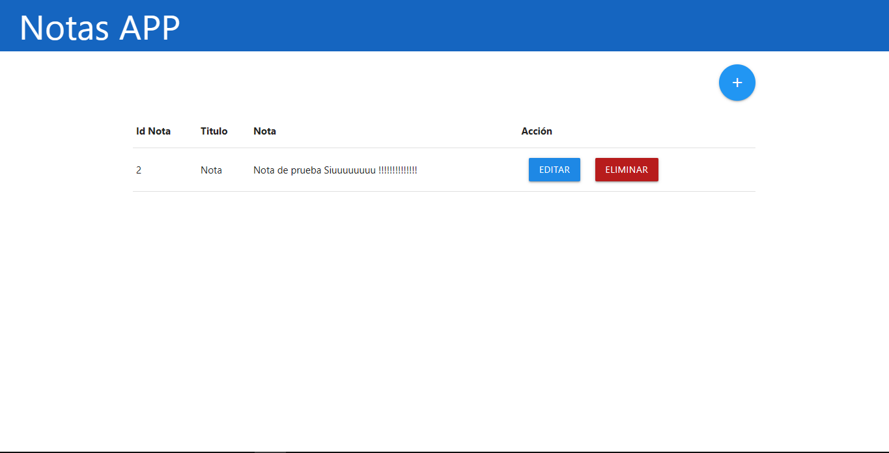
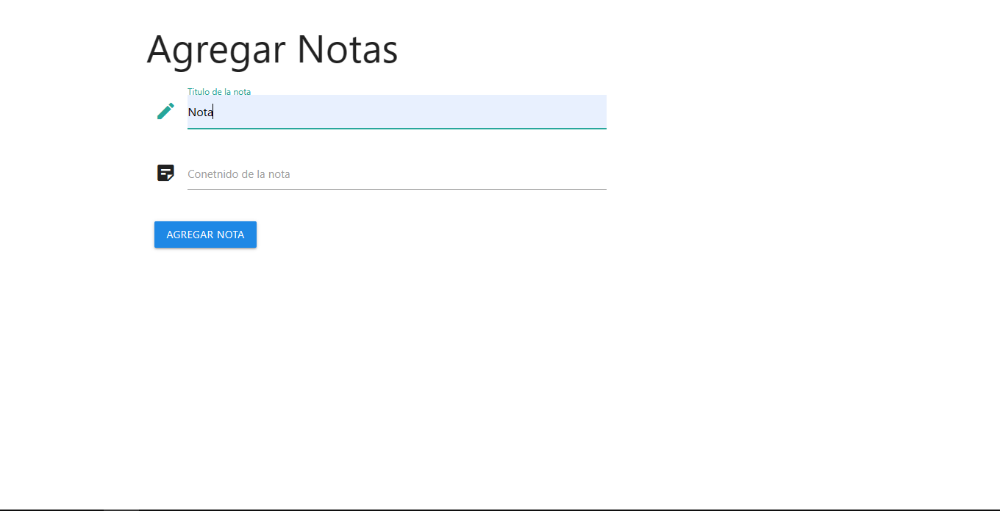

# CRUD-SQLite---PHP

## Descripción

Es un proyecto que consiste en una app para administrar notas hecho usando php que permite realizar las cuatro operaciones básicas: *create, read, update y delete* a una base de datos sqlite.

## Imagenes del proyecto
pantalla principal

formulario para agregar notas


## Estructura del proyecto

```

├── config
│   └── db.php
├── app
│   ├── controller
│   ├── model
│	└── views
└── DB

```
`config`: contine los archivos para acceder a la base de datos

`DB`: contine la base de datos sqlite

`app`: contine los archivos del proyecto, se uso el modelo mvc
